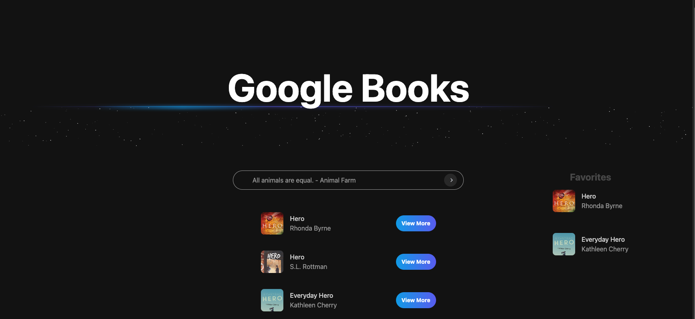

# Google Books Search App



## Overview

A web application for searching and managing favorite books using the Google Books API. Built with Vite, React, TypeScript, Tailwind CSS, Redux, and Axios.

## Features

- Search for books using the Google Books API.
- View detailed information about each book.
- Add and remove books from favorites.
- Responsive design with a mobile-friendly layout.
- Dark mode support.

## Technologies Used

- **Vite**: A build tool that provides a fast development environment.
- **React**: A JavaScript library for building user interfaces.
- **TypeScript**: A superset of JavaScript that adds static typing.
- **Tailwind CSS**: A utility-first CSS framework for rapid UI development.
- **Redux**: A state management library for JavaScript apps.
- **Axios**: A promise-based HTTP client for making requests.

## Getting Started

### Prerequisites

- Node.js (version 14 or later)
- npm or yarn

### Installation

Clone the repository:

```bash
git clone https://github.com/yourusername/google-books-search-app.git
cd google-books-search-app
# Navigate to the project directory:
Install the dependencies:
npm install
# or
yarn install
Running the App

# Start the development server:
npm run dev
# or
yarn dev
```

## Usage

- Enter a book title or author in the search bar and hit enter.
- Browse the search results and click on a book for more details.
- Click “Add to Favorites” to save a book for later.
- Access your favorites from the side menu.

## Contributing

Contributions are welcome! Please open an issue or submit a pull request for any suggestions or improvements.

## License

This project is licensed under the MIT License - see the LICENSE file for details.
